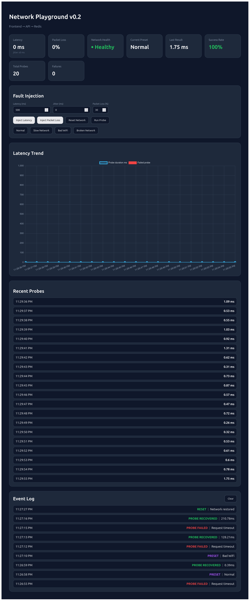

# Network Playground

A hands-on network fault injection playground for learning latency, packet loss, jitter, and service degradation.

Built with:

- FastAPI
- Redis
- Docker
- React
- Chart.js

The project simulates real-world network failures and visualizes their impact through live probes, metrics, and event logs.

## Features

### Network Fault Injection
- Latency injection using Linux tc / netem
- Jitter simulation
- Packet loss simulation
- One-click preset scenarios
- Network reset

### Continuous Probing
- Automatic probe execution every second
- Redis connectivity checks
- Success and failure tracking
- Rolling probe history

### Dashboard
- Network health status
- Current preset
- Last probe result
- Success rate
- Failure count
- Total probes

### Visualization
- Live latency trend chart
- Failed probe markers
- Recent probe history

### Event Log
- Fault injection events
- Preset changes
- Network reset events
- Probe failure detection
- Probe recovery detection

Event history keeps the latest 50 events.

## Architecture

```text
Frontend
   ↓
FastAPI Backend
   ↓
Redis
```

Network faults are injected inside the backend container using `tc`/`netem`.

## Screenshot



## Run

```bash
docker compose up --build
```

- Frontend: http://localhost:5173
- Backend: http://localhost:8000

## API

| Method | Endpoint                | Description                          |
| ------ | ----------------------- | ------------------------------------ |
| GET    | `/health`               | Health check (backend + Redis)       |
| GET    | `/network/status`       | Current network fault state          |
| GET    | `/network/probe`        | Run a probe against Redis            |
| POST   | `/network/latency`      | Inject latency (and optional jitter) |
| POST   | `/network/packet-loss`  | Inject packet loss                   |
| POST   | `/network/preset`       | Apply a named preset                 |
| POST   | `/network/reset`        | Clear all injected faults            |

### Examples

```bash
curl -X POST http://localhost:8000/network/latency \
  -H "Content-Type: application/json" \
  -d '{"delay_ms":500,"jitter_ms":100}'

curl -X POST http://localhost:8000/network/packet-loss \
  -H "Content-Type: application/json" \
  -d '{"loss_percent":30}'

curl -X POST http://localhost:8000/network/preset \
  -H "Content-Type: application/json" \
  -d '{"name":"bad-wifi"}'
```

## Presets

| Preset     | Latency | Jitter | Packet Loss |
| ---------- | ------- | ------ | ----------- |
| `normal`   | 0ms     | 0ms    | 0%          |
| `slow`     | 500ms   | 50ms   | 0%          |
| `bad-wifi` | 200ms   | 80ms   | 10%         |
| `broken`   | 800ms   | 200ms  | 60%         |


## Health States

| State      | Condition               |
| ---------- | ------------------------| 
| `Healthy`  | No degradation detected | 
| `Degraded` | Packet loss present     | 
| `Slow`     | High latency or jitter  | 
| `broken`   | Severe packet loss      | 

## What I Learned

- Linux traffic control (tc)
- Network fault simulation
- Latency, packet loss, and jitter behavior
- Health probing strategies
- Real-time dashboard updates with React
- perational visibility through metrics and event logs

## Notes

This project requires Linux networking support and the `NET_ADMIN` capability
in Docker (e.g. `cap_add: [NET_ADMIN]` in `docker-compose.yml`).